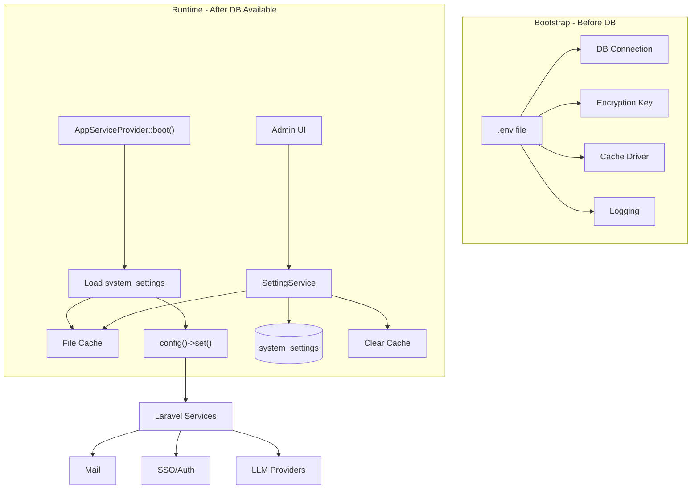

# Env to Database Migration Plan

## Goals

- Minimal `.env` file (only bootstrap essentials)
- SQLite as main global config store
- No performance overhead (aggressive caching)
- Seamless integration with Laravel's config system
- Admin UI for configuration management
- Support future Database Options (changing SQLite to MySQL/PostgreSQL)

---

## Architecture Overview



---

## Minimal .env (Target State)

After migration, `.env` will contain only ~10 bootstrap essentials:

```env
# Encryption (required before anything)
APP_KEY=base64:...

# Environment (affects error handling before DB)
APP_ENV=local
APP_DEBUG=true

# Database (chicken-and-egg - cannot be in DB)
DB_CONNECTION=sqlite
DB_DATABASE=/var/www/html/backend/database/database.sqlite

# Cache (needed to cache settings - use file, not DB)
CACHE_STORE=file

# Logging (needed before DB for errors)
LOG_CHANNEL=stack
LOG_LEVEL=debug

# Session driver (file avoids DB dependency at bootstrap)
SESSION_DRIVER=file
```

Everything else moves to `system_settings` table.

---

## Phase 1: SettingService Infrastructure

### 1.1 Create SettingService

New file: [backend/app/Services/SettingService.php](backend/app/Services/SettingService.php)

```php
class SettingService
{
    private const CACHE_KEY = 'system_settings:all';
    private const CACHE_TTL = 3600; // 1 hour
    
    // Get single setting with env fallback
    public function get(string $group, string $key, mixed $default = null): mixed
    
    // Get all settings for a group
    public function getGroup(string $group): array
    
    // Set a setting (auto-encrypts secrets)
    public function set(string $group, string $key, mixed $value, ?int $userId = null): void
    
    // Check if setting exists in DB (vs env fallback)
    public function isOverridden(string $group, string $key): bool
    
    // Reset setting to env default (delete from DB)
    public function reset(string $group, string $key): void
    
    // Load all settings into cache
    public function warmCache(): void
    
    // Clear settings cache
    public function clearCache(): void
    
    // Get all settings (for boot-time config injection)
    public function all(): array
```

### 1.2 Encryption for Secrets

Settings with sensitive data (API keys, passwords) stored encrypted:

```php
// In SettingService
private array $encryptedKeys = [
    'mail' => ['password'],
    'sso' => ['client_secret', 'private_key'],
    'notifications' => ['bot_token', 'api_key', 'webhook_url'],
    'llm' => ['api_key'],
    'backup' => ['aws_secret'],
];

public function set(string $group, string $key, mixed $value, ?int $userId = null): void
{
    $shouldEncrypt = in_array($key, $this->encryptedKeys[$group] ?? []);
    
    SystemSetting::updateOrCreate(
        ['group' => $group, 'key' => $key],
        [
            'value' => $shouldEncrypt ? encrypt($value) : $value,
            'is_encrypted' => $shouldEncrypt,
            'updated_by' => $userId,
        ]
    );
    
    $this->clearCache();
}
```

### 1.3 Add is_encrypted Column

New migration: `backend/database/migrations/xxxx_add_is_encrypted_to_system_settings.php`

```php
Schema::table('system_settings', function (Blueprint $table) {
    $table->boolean('is_encrypted')->default(false)->after('value');
});
```

---

## Phase 2: Boot-Time Config Injection

### 2.1 Config Service Provider

New file: [backend/app/Providers/ConfigServiceProvider.php](backend/app/Providers/ConfigServiceProvider.php)

Register early in `config/app.php` providers array.

```php
class ConfigServiceProvider extends ServiceProvider
{
    public function boot(): void
    {
        // Skip if DB not available (fresh install, migrations)
        if (!$this->databaseExists()) {
            return;
        }
        
        $settings = app(SettingService::class)->all();
        
        // Inject into Laravel config
        $this->injectMailConfig($settings['mail'] ?? []);
        $this->injectSsoConfig($settings['sso'] ?? []);
        $this->injectLlmConfig($settings['llm'] ?? []);
        $this->injectNotificationConfig($settings['notifications'] ?? []);
        $this->injectAppConfig($settings['general'] ?? []);
    }
    
    private function injectMailConfig(array $settings): void
    {
        if (isset($settings['mailer'])) {
            config(['mail.default' => $settings['mailer']]);
        }
        if (isset($settings['smtp_host'])) {
            config(['mail.mailers.smtp.host' => $settings['smtp_host']]);
        }
        // ... etc
    }
}
```

### 2.2 Database Existence Check

```php
private function databaseExists(): bool
{
    try {
        DB::connection()->getPdo();
        return Schema::hasTable('system_settings');
    } catch (\Exception $e) {
        return false;
    }
}
```

---

## Phase 3: Settings Migration (Env to DB)

### 3.1 Settings Definition Map

Create a registry of all migratable settings:

New file: [backend/config/settings-schema.php](backend/config/settings-schema.php)

```php
return [
    'mail' => [
        'mailer' => ['env' => 'MAIL_MAILER', 'default' => 'log', 'public' => false],
        'smtp_host' => ['env' => 'MAIL_HOST', 'default' => '127.0.0.1', 'public' => false],
        'smtp_port' => ['env' => 'MAIL_PORT', 'default' => 587, 'public' => false],
        'smtp_username' => ['env' => 'MAIL_USERNAME', 'default' => null, 'public' => false],
        'smtp_password' => ['env' => 'MAIL_PASSWORD', 'default' => null, 'public' => false, 'encrypted' => true],
        'from_address' => ['env' => 'MAIL_FROM_ADDRESS', 'default' => 'hello@example.com', 'public' => false],
        'from_name' => ['env' => 'MAIL_FROM_NAME', 'default' => 'Sourdough', 'public' => false],
    ],
    
    'sso' => [
        'google_enabled' => ['env' => null, 'default' => false, 'public' => true],
        'google_client_id' => ['env' => 'GOOGLE_CLIENT_ID', 'default' => null, 'public' => false],
        'google_client_secret' => ['env' => 'GOOGLE_CLIENT_SECRET', 'default' => null, 'public' => false, 'encrypted' => true],
        // ... other providers
    ],
    
    'llm' => [
        'mode' => ['env' => 'LLM_MODE', 'default' => 'single', 'public' => false],
        'primary' => ['env' => 'LLM_PRIMARY', 'default' => 'claude', 'public' => false],
        'anthropic_api_key' => ['env' => 'ANTHROPIC_API_KEY', 'default' => null, 'public' => false, 'encrypted' => true],
        'openai_api_key' => ['env' => 'OPENAI_API_KEY', 'default' => null, 'public' => false, 'encrypted' => true],
        // ... etc
    ],
    
    'notifications' => [
        'telegram_bot_token' => ['env' => 'TELEGRAM_BOT_TOKEN', 'default' => null, 'public' => false, 'encrypted' => true],
        'discord_webhook_url' => ['env' => 'DISCORD_WEBHOOK_URL', 'default' => null, 'public' => false, 'encrypted' => true],
        // ... etc
    ],
    
    'general' => [
        'app_name' => ['env' => 'APP_NAME', 'default' => 'Sourdough', 'public' => true],
        'app_url' => ['env' => 'APP_URL', 'default' => 'http://localhost', 'public' => true],
        'timezone' => ['env' => 'APP_TIMEZONE', 'default' => 'UTC', 'public' => true],
    ],
    
    'backup' => [
        'disk' => ['env' => 'BACKUP_DISK', 'default' => 'local', 'public' => false],
        'retention_days' => ['env' => 'BACKUP_RETENTION_DAYS', 'default' => 30, 'public' => false],
        // ... etc
    ],
];
```

### 3.2 Import Command

New command: `php artisan settings:import-env`

```php
// Reads settings-schema.php
// For each setting, if env var is set and not empty:
//   - Store value in system_settings table
//   - Mark as imported
// Provides summary of what was imported
```

---

## Phase 4: Caching Strategy

### 4.1 File-Based Cache (Not DB)

Critical: Use `CACHE_STORE=file` to avoid circular dependency.

```php
// In SettingService
public function all(): array
{
    return Cache::store('file')->remember(
        self::CACHE_KEY,
        self::CACHE_TTL,
        fn () => $this->loadAllFromDatabase()
    );
}
```

### 4.2 Cache Invalidation

```php
public function clearCache(): void
{
    Cache::store('file')->forget(self::CACHE_KEY);
}

// Called automatically after set(), reset()
```

### 4.3 In-Memory Cache for Same Request

```php
private ?array $memoryCache = null;

public function all(): array
{
    if ($this->memoryCache !== null) {
        return $this->memoryCache;
    }
    
    $this->memoryCache = Cache::store('file')->remember(...);
    return $this->memoryCache;
}
```

---

## Phase 5: Admin API Endpoints

### 5.1 Settings Controller

Enhance: [backend/app/Http/Controllers/Api/SettingsController.php](backend/app/Http/Controllers/Api/SettingsController.php)

```php
// GET /api/admin/settings/{group}
public function show(string $group): JsonResponse

// PUT /api/admin/settings/{group}
public function update(Request $request, string $group): JsonResponse

// POST /api/admin/settings/{group}/test
public function test(Request $request, string $group): JsonResponse

// DELETE /api/admin/settings/{group}/{key}
public function reset(string $group, string $key): JsonResponse
```

### 5.2 API Routes

Add to [backend/routes/api.php](backend/routes/api.php):

```php
Route::prefix('admin/settings')->middleware(['auth:sanctum', 'admin'])->group(function () {
    Route::get('{group}', [SettingsController::class, 'show']);
    Route::put('{group}', [SettingsController::class, 'update']);
    Route::post('{group}/test', [SettingsController::class, 'test']);
    Route::delete('{group}/{key}', [SettingsController::class, 'reset']);
});
```

---

## Phase 6: Admin UI Configuration Pages

All settings moving to the database must be configurable through the admin UI. Each settings group gets a dedicated configuration page under `/configuration/`.

### 6.1 Configuration Pages Overview

| Route | Settings Group | Purpose |
|-------|----------------|---------|
| `/configuration/system` | `general` | App name, URL, timezone, locale |
| `/configuration/email` | `mail` | SMTP/provider configuration |
| `/configuration/sso` | `sso` | SSO provider credentials |
| `/configuration/llm` | `llm` | LLM provider API keys and settings |
| `/configuration/notifications` | `notifications` | Notification channel provider settings |
| `/configuration/backup` | `backup` | Backup storage and retention settings |

### 6.2 System Settings Page

Route: `/configuration/system`

**Fields:**
- App Name (text input)
- App URL (text input with URL validation)
- Timezone (dropdown with common timezones)
- Default Locale (dropdown)

**UI Features:**
- Live preview of app name in header
- "Test URL" button to verify accessibility
- Reset to default button per field

### 6.3 Email Configuration Page

Route: `/configuration/email`

**Fields:**
- Mail Provider (dropdown: SMTP, Mailgun, SendGrid, SES, Postmark, Log)
- SMTP Host, Port, Encryption (conditional on SMTP provider)
- Username, Password (masked input, encrypted storage)
- From Address, From Name
- API Key (for API-based providers, masked)

**UI Features:**
- Dynamic form fields based on provider selection
- "Send Test Email" button with recipient input
- Connection status indicator
- Password reveal toggle (shows masked by default)

### 6.4 SSO Providers Page

Route: `/configuration/sso`

**Provider Cards (for each: Google, GitHub, Microsoft, Apple, Discord, GitLab, OIDC):**
- Enable/Disable toggle
- Client ID (text input)
- Client Secret (masked input, encrypted storage)
- Callback URL (read-only, auto-generated, with copy button)
- Provider-specific fields (Tenant ID for Microsoft, GitLab URL, OIDC Issuer)

**UI Features:**
- Card-based layout, one card per provider
- Status badges: Configured, Not Configured, Disabled
- "Test Connection" button per provider
- Collapsible cards to reduce clutter

### 6.5 LLM Providers Page

Route: `/configuration/llm`

**Global Settings:**
- Default Mode (dropdown: Single, Council, Aggregation)
- Primary Provider (dropdown of enabled providers)
- Request Timeout (number input)
- Enable Logging (toggle)

**Provider Cards (Claude, OpenAI, Gemini, Ollama, Bedrock, Azure):**
- Enable/Disable toggle
- API Key (masked input, encrypted storage)
- Model selection (dropdown or text input)
- Max Tokens (number input)
- Provider-specific: Base URL (Ollama), Endpoint/Deployment (Azure), Region (Bedrock)

**UI Features:**
- "Test API Key" button per provider
- Model availability indicator
- Usage/cost tracking display (future)

### 6.6 Notification Providers Page

Route: `/configuration/notifications`

**Provider Cards:**
- **Telegram**: Bot Token (masked), Default Chat ID
- **Discord**: Webhook URL (masked)
- **Slack**: Webhook URL (masked)
- **Twilio**: Account SID, Auth Token (masked), From Number
- **Vonage**: API Key, API Secret (masked), From Number
- **VAPID (Web Push)**: Public Key, Private Key (masked)
- **ntfy**: Server URL, Default Topic

**UI Features:**
- "Test Notification" button per provider
- Enable/Disable toggle per provider
- Status: Configured, Not Configured
- Link to user notification preferences (separate from provider config)

### 6.7 Backup Configuration Page

Route: `/configuration/backup`

**Fields:**
- Storage Driver (dropdown: Local, S3, Custom)
- S3 Bucket, Region, Endpoint (conditional on S3)
- AWS Access Key, Secret Key (masked, encrypted)
- Retention Days (number input)
- Backup Schedule (cron expression or presets)

**UI Features:**
- "Test Connection" button for S3
- Storage usage indicator
- Manual backup trigger button
- Backup history list

### 6.8 Common UI Patterns

All configuration pages should follow these patterns:

**Form Layout:**
```
┌─────────────────────────────────────────────┐
│ Page Title                    [Save Button] │
├─────────────────────────────────────────────┤
│ Section Header                              │
│ ┌─────────────────────────────────────────┐ │
│ │ Field Label              [Reset Button] │ │
│ │ [Input Field                          ] │ │
│ │ Helper text / validation error          │ │
│ └─────────────────────────────────────────┘ │
│                                             │
│ [Test Connection]                           │
└─────────────────────────────────────────────┘
```

**Sensitive Fields:**
- Show as `••••••••` by default
- Eye icon to reveal temporarily
- Copy button (copies without revealing)
- "Change" mode vs "View" mode

**Reset to Default:**
- Per-field reset button (shows only if overridden)
- Resets to env value or schema default
- Confirmation dialog for destructive resets

**Validation:**
- Client-side validation for format (URLs, emails)
- Server-side validation on save
- "Test" buttons for connection validation

### 6.9 Frontend Files to Create/Modify

| File | Action | Purpose |
|------|--------|---------|
| `frontend/app/(dashboard)/configuration/system/page.tsx` | Modify | Add general settings form |
| `frontend/app/(dashboard)/configuration/email/page.tsx` | Create | Email/SMTP configuration |
| `frontend/app/(dashboard)/configuration/sso/page.tsx` | Create | SSO provider cards |
| `frontend/app/(dashboard)/configuration/llm/page.tsx` | Create | LLM provider configuration |
| `frontend/app/(dashboard)/configuration/notifications/page.tsx` | Modify | Add provider config section |
| `frontend/app/(dashboard)/configuration/backup/page.tsx` | Modify | Add storage settings |
| `frontend/components/configuration/settings-form.tsx` | Create | Reusable settings form component |
| `frontend/components/configuration/secret-input.tsx` | Create | Masked input with reveal toggle |
| `frontend/components/configuration/provider-card.tsx` | Create | Reusable provider config card |
| `frontend/lib/settings-api.ts` | Create | API client for settings endpoints |

---

## Phase 7: Database Options Consideration

When user wants to switch databases (future roadmap):

1. New DB connection configured in `.env` (manual - required restart)
2. Run `php artisan migrate` on new database
3. Export settings from old DB: `php artisan settings:export`
4. Import settings to new DB: `php artisan settings:import`

The SettingService doesn't need to know which database is used - it just uses Laravel's default connection.

---

## Phase 8: Documentation and Recipes

Create comprehensive documentation and step-by-step recipes for extending the settings system.

### 8.1 Recipe: Adding a New SSO Provider

New file: `docs/ai/recipes/add-sso-provider.md`

**Recipe covers:**
1. Add provider config to `settings-schema.php`
2. Update `ConfigServiceProvider` to inject provider settings
3. Create/update Socialite driver configuration
4. Add provider card to SSO configuration UI
5. Add callback route and controller method
6. Test connection flow
7. Update documentation

### 8.2 Recipe: Adding a New LLM Provider

New file: `docs/ai/recipes/add-llm-provider.md`

**Recipe covers:**
1. Add provider config to `settings-schema.php` (api_key, model, etc.)
2. Create provider driver class in `backend/app/Services/LLM/Providers/`
3. Register driver in LLM configuration
4. Update `ConfigServiceProvider` for provider injection
5. Add provider card to LLM configuration UI
6. Implement API key validation/test endpoint
7. Update documentation

### 8.3 Recipe: Adding a New Settings Group

New file: `docs/ai/recipes/add-settings-group.md`

**Recipe covers:**
1. Define settings in `settings-schema.php` with group name
2. Add injection method in `ConfigServiceProvider`
3. Create API endpoint for the group in `SettingsController`
4. Create configuration page in frontend
5. Add navigation link in configuration layout
6. Add appropriate test coverage
7. Update features documentation

### 8.4 Recipe: Adding a New Notification Provider

Update existing: `docs/ai/recipes/add-notification-channel.md`

**Add section for:**
1. Adding provider settings to `settings-schema.php`
2. Creating provider card in notifications configuration UI
3. Connecting settings to channel class
4. Testing provider configuration

### 8.5 Documentation Updates

**Files to update:**

| File | Updates |
|------|---------|
| `docs/features.md` | Document all new configuration pages and capabilities |
| `docs/ai/patterns.md` | Add settings form patterns, secret input patterns, provider card patterns |
| `docs/ai/context-loading.md` | Add settings-related files to context loading guide |
| `docs/development.md` | Update with new `.env` minimal requirements |
| `docs/plans/env-to-database-roadmap.md` | Mark complete, document final approach |

### 8.6 Recipes to Create

| Recipe | Purpose |
|--------|---------|
| `docs/ai/recipes/add-sso-provider.md` | Step-by-step for new SSO providers |
| `docs/ai/recipes/add-llm-provider.md` | Step-by-step for new LLM providers |
| `docs/ai/recipes/add-settings-group.md` | Step-by-step for new config categories |

---

## Files to Create

### Backend

| File | Purpose |
|------|---------|
| `backend/app/Services/SettingService.php` | Core settings service with caching |
| `backend/app/Providers/ConfigServiceProvider.php` | Boot-time config injection |
| `backend/config/settings-schema.php` | Settings definition registry |
| `backend/database/migrations/xxxx_add_is_encrypted_to_system_settings.php` | Add encryption flag |
| `backend/app/Console/Commands/ImportEnvSettings.php` | Import env vars to DB |
| `backend/app/Console/Commands/ExportSettings.php` | Export for DB migration |

### Frontend

| File | Purpose |
|------|---------|
| `frontend/app/(dashboard)/configuration/email/page.tsx` | Email/SMTP configuration page |
| `frontend/app/(dashboard)/configuration/sso/page.tsx` | SSO provider configuration page |
| `frontend/app/(dashboard)/configuration/llm/page.tsx` | LLM provider configuration page |
| `frontend/components/configuration/settings-form.tsx` | Reusable settings form with validation |
| `frontend/components/configuration/secret-input.tsx` | Masked input with reveal/copy |
| `frontend/components/configuration/provider-card.tsx` | Collapsible provider config card |
| `frontend/components/configuration/test-connection-button.tsx` | Reusable test button with status |
| `frontend/lib/settings-api.ts` | API client for admin settings |

## Files to Modify

### Backend

| File | Changes |
|------|---------|
| `backend/config/app.php` | Register ConfigServiceProvider early |
| `backend/app/Models/SystemSetting.php` | Add is_encrypted handling |
| `backend/routes/api.php` | Add admin settings routes |
| `backend/.env.example` | Reduce to bootstrap essentials only |

### Frontend

| File | Changes |
|------|---------|
| `frontend/app/(dashboard)/configuration/system/page.tsx` | Add general settings form (app name, URL, timezone) |
| `frontend/app/(dashboard)/configuration/notifications/page.tsx` | Add provider configuration section |
| `frontend/app/(dashboard)/configuration/backup/page.tsx` | Add storage configuration |
| `frontend/app/(dashboard)/configuration/layout.tsx` | Add new nav items (Email, SSO, LLM) |

### Documentation - Updates

| File | Changes |
|------|---------|
| `docs/plans/env-to-database-roadmap.md` | Update status and approach |
| `docs/features.md` | Document new configuration UI and capabilities |
| `docs/ai/patterns.md` | Add settings form patterns, secret input, provider cards |
| `docs/ai/context-loading.md` | Add settings-related files |
| `docs/development.md` | Update minimal `.env` requirements |
| `docs/ai/recipes/add-notification-channel.md` | Add settings integration section |

### Documentation - New Recipes

| File | Purpose |
|------|---------|
| `docs/ai/recipes/add-sso-provider.md` | Step-by-step guide for adding new SSO providers |
| `docs/ai/recipes/add-llm-provider.md` | Step-by-step guide for adding new LLM providers |
| `docs/ai/recipes/add-settings-group.md` | Step-by-step guide for adding new configuration categories |

---

## Migration Path for Existing Deployments

1. Update code (new SettingService, ConfigServiceProvider)
2. Run migration (add is_encrypted column)
3. Run `php artisan settings:import-env` (copies env values to DB)
4. Verify application works
5. (Optional) Remove migrated vars from `.env`
6. Old deployments with env vars continue to work (env fallback)

---

## Success Criteria

### Infrastructure
- [ ] `.env` contains only ~10 bootstrap variables
- [ ] All other settings stored in `system_settings` table
- [ ] Settings cached in file cache (not DB)
- [ ] No performance regression (cache hit on every request)
- [ ] Secrets encrypted in database
- [ ] Existing deployments continue working (backward compatible)

### Admin UI
- [ ] Email configuration page with provider selection and test email
- [ ] SSO configuration page with provider cards and test connection
- [ ] LLM configuration page with provider cards and API key testing
- [ ] Notifications page includes provider settings (not just user preferences)
- [ ] System settings page with app name, URL, timezone
- [ ] Backup page with storage configuration
- [ ] All sensitive fields masked with reveal toggle
- [ ] Reset to default functionality per setting
- [ ] Changes take effect immediately without restart

### Documentation and Recipes
- [ ] Clear documentation of what must stay in env vs what can be in DB
- [ ] Configuration UI documented in features.md
- [ ] Settings form patterns added to AI patterns guide
- [ ] Recipe: Adding a new SSO provider (`docs/ai/recipes/add-sso-provider.md`)
- [ ] Recipe: Adding a new LLM provider (`docs/ai/recipes/add-llm-provider.md`)
- [ ] Recipe: Adding a new settings group (`docs/ai/recipes/add-settings-group.md`)
- [ ] Updated notification channel recipe with settings integration
- [ ] Context loading guide updated with settings files
