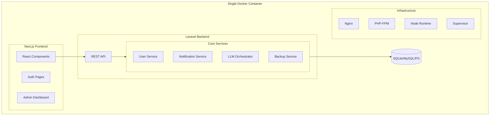
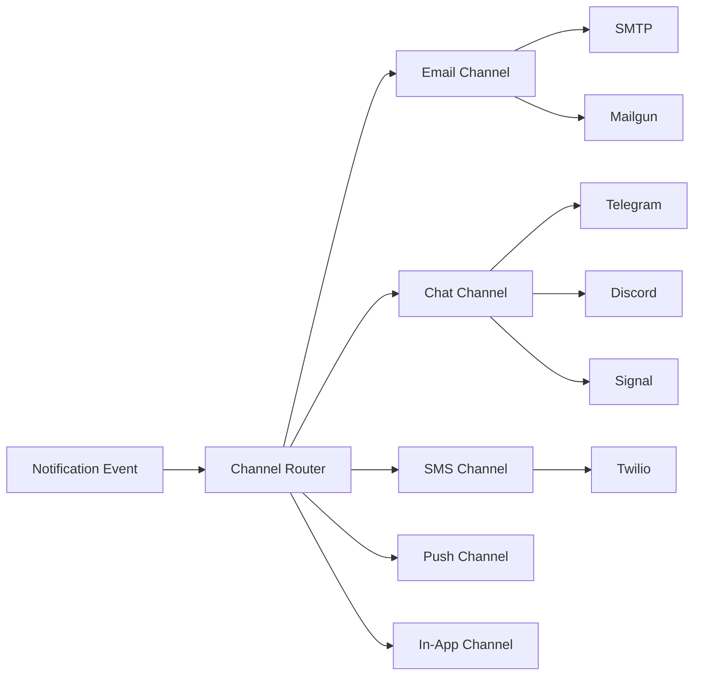
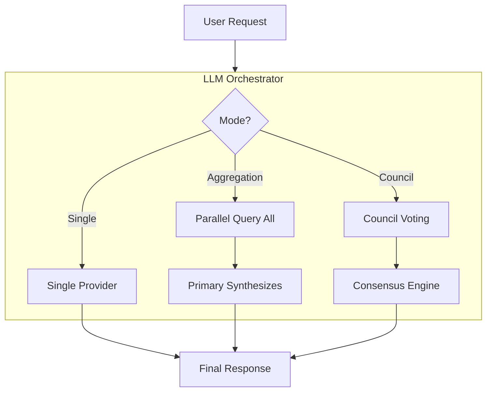

# Sourdough: Starter Application Framework for AI Development

A high-level architecture plan for building a starter framework that AI can use to develop other apps. Each section below will require its own detailed implementation plan.

---

## Architecture Overview



---

## Section 1: User Management System

**Goal**: Enterprise-grade authentication with SSO, 2FA, and self-hosted simplicity

**Subsections**:

- **1.1 Core Authentication** - Email/password, session management (Laravel Sanctum)
- **1.2 SSO Integration** - OAuth2/OIDC providers via Laravel Socialite
  - Google, GitHub, Microsoft, Apple, Discord, GitLab
  - Generic OIDC provider for enterprise IdPs
- **1.3 Two-Factor Authentication** - TOTP (Google Authenticator compatible) + recovery codes
- **1.4 Password Reset Flow** - Token-based reset with email delivery
- **1.5 Email Verification** - Optional verification with configurable enforcement
- **1.6 Self-Hosting Mode** - All features optional, single admin user possible

**Key Files to Create**:

- `backend/app/Services/Auth/SSOService.php`
- `backend/app/Services/Auth/TwoFactorService.php`
- `backend/config/sso.php` - Provider configuration
- `frontend/app/(auth)/` - Next.js auth pages

**Reference**: Housarr's `AuthController.php` for base flow, extend with Socialite

---

## Section 2: Notification System

**Goal**: Unified notification hub supporting all major platforms

**Subsections**:

- **2.1 Notification Architecture** - Provider abstraction layer with queue support
- **2.2 Email Provider** - SMTP, Mailgun, SendGrid, SES, Postmark (from DanaVision)
- **2.3 Chat Platforms** - Telegram, Discord, Slack webhooks
- **2.4 Secure Messaging** - Signal (via signal-cli), Matrix
- **2.5 SMS** - Twilio, Vonage, AWS SNS
- **2.6 Push Notifications** - Web Push, Firebase Cloud Messaging
- **2.7 In-App Notifications** - Database-backed with real-time via WebSockets



**Key Files to Create**:

- `backend/app/Services/Notifications/NotificationOrchestrator.php`
- `backend/app/Services/Notifications/Channels/` - Each channel
- `backend/config/notifications.php` - Channel configuration

**Reference**: Housarr's `MailService.php`, extend significantly

---

## Section 3: AI/LLM System

**Goal**: Flexible multi-LLM system with single, aggregation, and council modes

**Subsections**:

- **3.1 Provider Abstraction** - Unified interface for all LLM providers
- **3.2 Supported Providers**:
  - Claude (Anthropic) - Text + Vision
  - OpenAI (GPT-4, GPT-4o) - Text + Vision
  - Gemini (Google) - Text + Vision
  - Local/Ollama - Self-hosted models
  - Anthropic Claude via AWS Bedrock
  - Azure OpenAI
- **3.3 Operating Modes**:
  - **Single Mode** - One provider, direct responses
  - **Aggregation Mode** - Query multiple, primary synthesizes
  - **Council Mode** - All providers vote/contribute, consensus resolution
- **3.4 Vision/Image Support** - Unified image analysis across providers
- **3.5 Request Logging** - Track all AI requests for debugging/cost analysis
- **3.6 API Key Management** - Encrypted per-user storage



**Key Files to Create**:

- `backend/app/Services/LLM/LLMOrchestrator.php`
- `backend/app/Services/LLM/Providers/` - Each provider
- `backend/app/Services/LLM/Modes/` - Single, Aggregation, Council
- `backend/config/llm.php`

**Reference**: Housarr's `AIAgentOrchestrator.php` (1100+ lines) - excellent foundation

---

## Section 4: Database Abstraction

**Goal**: Default SQLite with migration path to production databases

**Subsections**:

- **4.1 Default SQLite** - Zero-config embedded database
- **4.2 MySQL/MariaDB Support** - Full compatibility
- **4.3 PostgreSQL Support** - Full compatibility
- **4.4 Supabase Support** - PostgreSQL with Supabase-specific features
- **4.5 Migration Tools** - Data migration between database types
- **4.6 Connection Management** - Runtime database switching

**Key Considerations**:

- Avoid SQLite-specific SQL (JSON functions, CTEs may vary)
- Use Laravel's database abstraction consistently
- Test all migrations against all supported databases

**Reference**: Both repos use SQLite default, extend `config/database.php`

---

## Section 5: Backup and Restore System

**Goal**: Comprehensive backup including database, files, and configuration

**Subsections**:

- **5.1 Backup Format** - ZIP with manifest (extend Housarr's v2.0)
- **5.2 Database Backup** - SQLite file copy, MySQL/PG dump
- **5.3 File Backup** - All uploaded files and assets
- **5.4 Configuration Backup** - Settings, provider configs (encrypted)
- **5.5 Scheduled Backups** - Cron-based automatic backups
- **5.6 Remote Storage** - S3, SFTP, Google Drive backup destinations
- **5.7 Restore System** - Validation, rollback on failure

**Key Files to Create**:

- `backend/app/Services/Backup/BackupService.php`
- `backend/app/Services/Backup/RestoreService.php`
- `backend/app/Services/Backup/Destinations/` - Storage adapters

**Reference**: Housarr's `BackupController.php` and ADR-009

---

## Section 6: Versioning System

**Goal**: Always know what version is running

**Subsections**:

- **6.1 Semantic Versioning** - MAJOR.MINOR.PATCH
- **6.2 Version File** - `VERSION` file in root
- **6.3 Build Metadata** - Git commit SHA, build timestamp
- **6.4 Version API** - Endpoint to query version
- **6.5 Migration Versioning** - Track schema version
- **6.6 Update Detection** - Check for newer versions (optional)

**Key Files to Create**:

- `VERSION` - Version file
- `backend/app/Services/VersionService.php`
- `backend/config/version.php`
- GitHub Actions for version tagging

---

## Section 7: Docker Infrastructure

**Goal**: Single container, production-ready, self-hosted

**Subsections**:

- **7.1 Multi-Stage Build** - Build frontend, create slim runtime image
- **7.2 Process Management** - Supervisor for Nginx, PHP-FPM, Queue
- **7.3 Health Checks** - `/health` endpoint, container health
- **7.4 Volume Strategy** - Database, storage, backups
- **7.5 Environment Configuration** - All settings via env vars
- **7.6 Production Safety** - Prevent accidental data loss (from DanaVision)

**Key Files to Create**:

- `docker/Dockerfile` - Multi-stage build
- `docker/entrypoint.sh` - Startup script
- `docker/supervisord.conf`
- `docker/nginx.conf`
- `docker-compose.yml` - Development
- `docker-compose.prod.yml` - Production

**Reference**: Both repos have excellent Docker setups to combine

---

## Section 8: Documentation System

**Goal**: Comprehensive, maintainable documentation

**Subsections**:

- **8.1 ADR System** - Architecture Decision Records
- **8.2 API Documentation** - OpenAPI/Swagger specs
- **8.3 User Documentation** - Setup, configuration, usage
- **8.4 Developer Documentation** - Contributing, extending
- **8.5 README** - Quick start, overview
- **8.6 Changelog** - Version history

**Directory Structure**:

```
docs/
├── adr/                 # Architecture Decision Records
│   ├── 000-template.md
│   ├── 001-technology-stack.md
│   └── ...
├── api/                 # API documentation
├── user/                # End-user guides
├── dev/                 # Developer guides
├── CHANGELOG.md
└── DOCUMENTATION.md     # Main index
```

**Reference**: Both repos have good ADR patterns (17 and 16 ADRs respectively)

---

## Section 9: Next.js Frontend Architecture

**Goal**: Modern, type-safe frontend with excellent DX

**Subsections**:

- **9.1 App Router** - Next.js 14+ app directory structure
- **9.2 Authentication UI** - Login, register, SSO, 2FA pages
- **9.3 Admin Dashboard** - User management, system settings
- **9.4 Component Library** - Reusable UI components (shadcn/ui)
- **9.5 API Client** - Type-safe API communication
- **9.6 State Management** - Zustand for global state
- **9.7 Dark Mode** - System preference + manual toggle

**Note**: This differs from reference repos (React SPA in Housarr, Inertia in DanaVision)

---

## Section 10: Testing Strategy

**Goal**: Comprehensive test coverage

**Subsections**:

- **10.1 Backend Unit Tests** - Pest PHP for services
- **10.2 Backend Feature Tests** - API endpoint testing
- **10.3 Frontend Tests** - Vitest for components
- **10.4 E2E Tests** - Playwright for full flows
- **10.5 CI/CD Integration** - GitHub Actions test pipeline

**Reference**: Both repos have testing strategies documented in ADRs

---

## Project Structure

```
sourdough/
├── backend/                    # Laravel API
│   ├── app/
│   │   ├── Http/Controllers/
│   │   ├── Models/
│   │   ├── Policies/
│   │   └── Services/
│   │       ├── Auth/
│   │       ├── LLM/
│   │       ├── Notifications/
│   │       ├── Backup/
│   │       └── Version/
│   ├── config/
│   ├── database/
│   └── routes/
├── frontend/                   # Next.js
│   ├── app/
│   ├── components/
│   └── lib/
├── docker/
├── docs/
│   └── adr/
├── scripts/
├── VERSION
├── docker-compose.yml
└── README.md
```

---

## Implementation Order (Recommended)

1. **Infrastructure First** - Docker, database, versioning
2. **Core Auth** - Basic email/password authentication
3. **Frontend Shell** - Next.js with auth pages
4. **Extended Auth** - SSO, 2FA, password reset, email verification
5. **Notification System** - Channel abstraction, providers
6. **LLM System** - Provider abstraction, modes
7. **Backup System** - Export/import functionality
8. **Documentation** - ADRs throughout, final user docs
9. **Testing** - Tests alongside each section

---

## Initial ADRs to Create

1. **ADR-001**: Technology Stack (Laravel + Next.js + SQLite)
2. **ADR-002**: Authentication Architecture
3. **ADR-003**: SSO Provider Integration
4. **ADR-004**: Notification System Architecture
5. **ADR-005**: LLM Orchestration Modes
6. **ADR-006**: Database Abstraction Strategy
7. **ADR-007**: Backup System Design
8. **ADR-008**: Docker Single-Container Architecture
9. **ADR-009**: Versioning Strategy